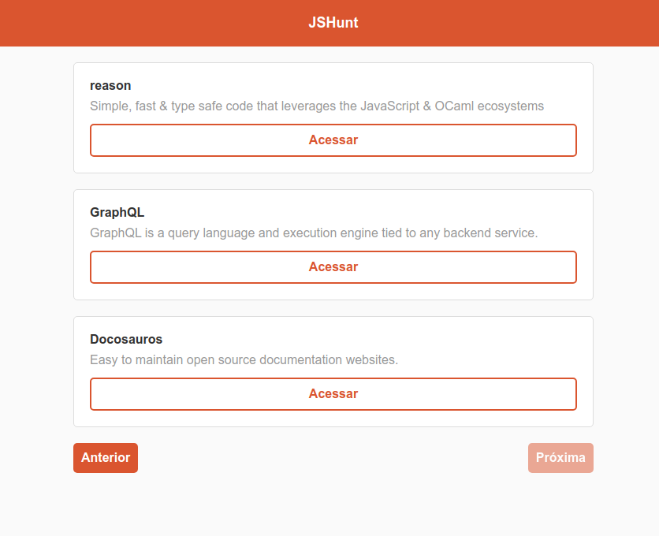

## Curso de React.js grátis

### Instalações
#### Criação do projeto
`create-react-app nome-projeto`

#### Instalação do Axios (Para fazer requisição a API)
`yarn add axios`

#### Instalação do componente de rotas para multiplas paginas
`yarn add react-router-dom`